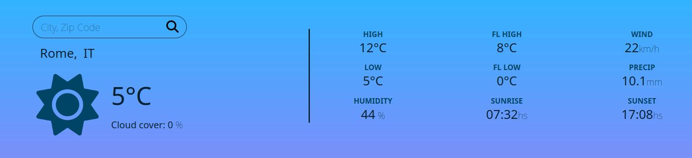
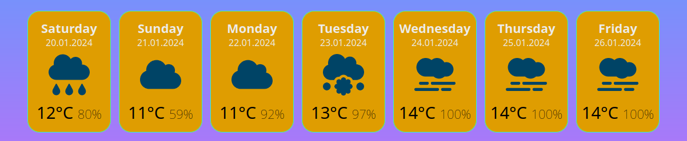

# Weather App

This is a simple weather app built with Vanilla JavaScript using the Vite build tool. It fetches weather data from Open-Meteo and OpenWeather APIs to provide users with current weather information, a 7-day forecast, and hourly data for the next 7 days.

## Features

### 1. Current Weather

Display the current weather conditions including temperature, humidity, wind speed, and other relevant details.


### 2. 7-Day Forecast

Show a forecast for the next 7 days, providing users with an overview of the expected weather conditions.


### 3. Hourly Forecast

Present detailed hourly forecasts with a step of three hours for the next 7 days, allowing users to plan their activities based on specific time intervals.


## APIs Used

- [Open-Meteo API](https://open-meteo.com/): Provides current weather data and forecasts.
- [OpenWeather API](https://openweathermap.org/): Offers additional weather data for enhanced accuracy and coverage.


## Getting Started

1. Clone the repository:

   ```bash
   git clone https://github.com/your-username/weatherApp.git

2. Navigate to the project directory:

    ```cd weather-app ```

3. Install dependencies:

    ``` npm install```

4. Run the development server:

    ```npm run dev```

This will start the development server, and you can access the app in your browser at http://localhost

## API Keys

To use the app, you need to obtain the Geocoding API key from OpenWeather. Follow these steps:

1. Create a file named `apiKeys.js` in the root of the project.
2. Copy and paste:

    `export const openWeatherApiKey = 'YOUR_OPEN_WEATHER_API_KEY';`.
3. Replace the dummy values with your actual API key into the `apiKeys.js` file.
